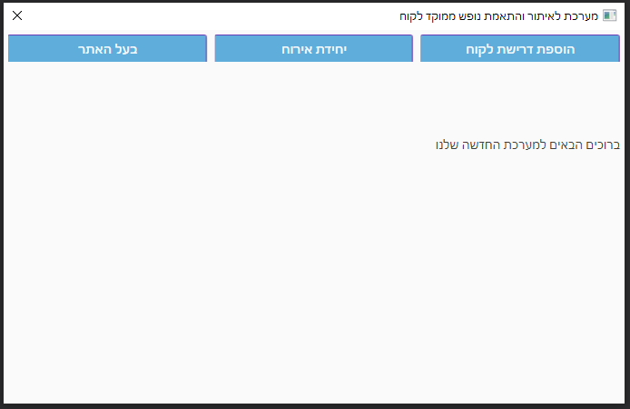
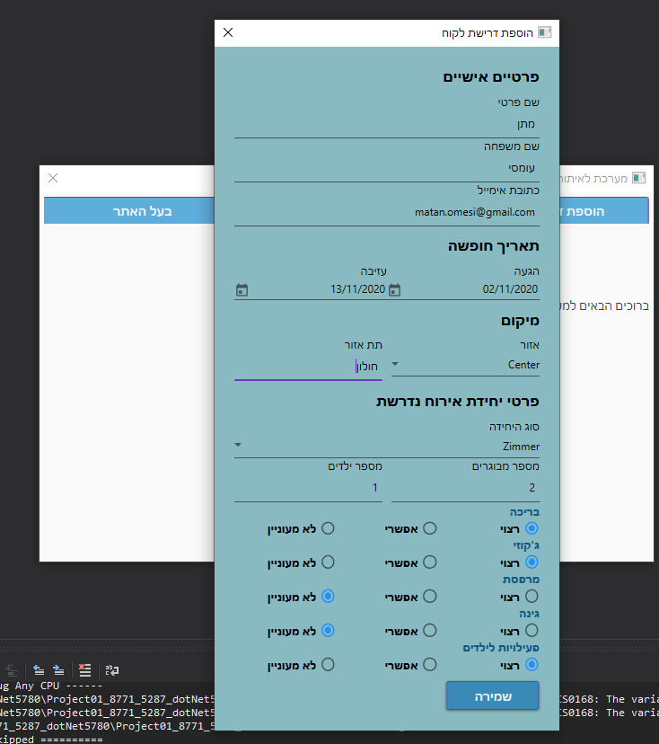
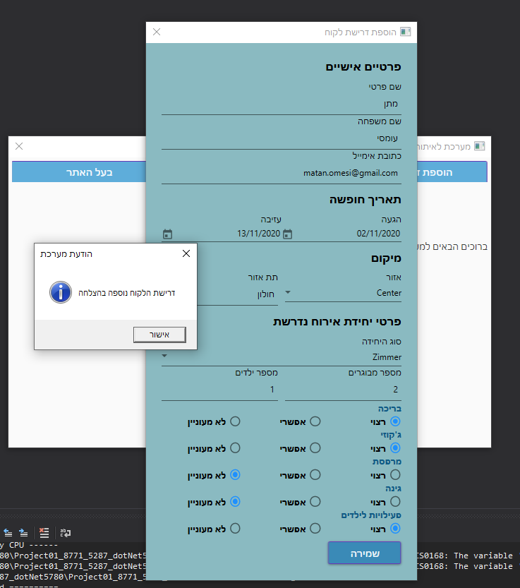
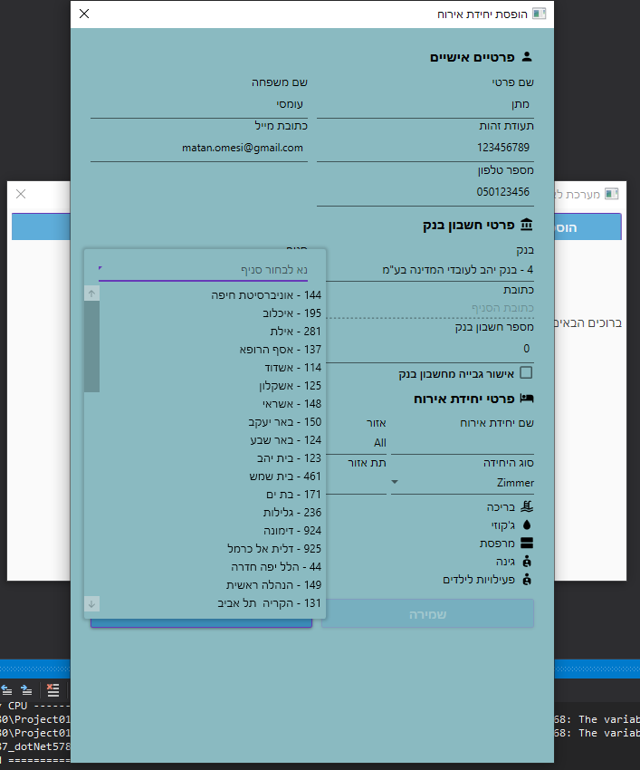
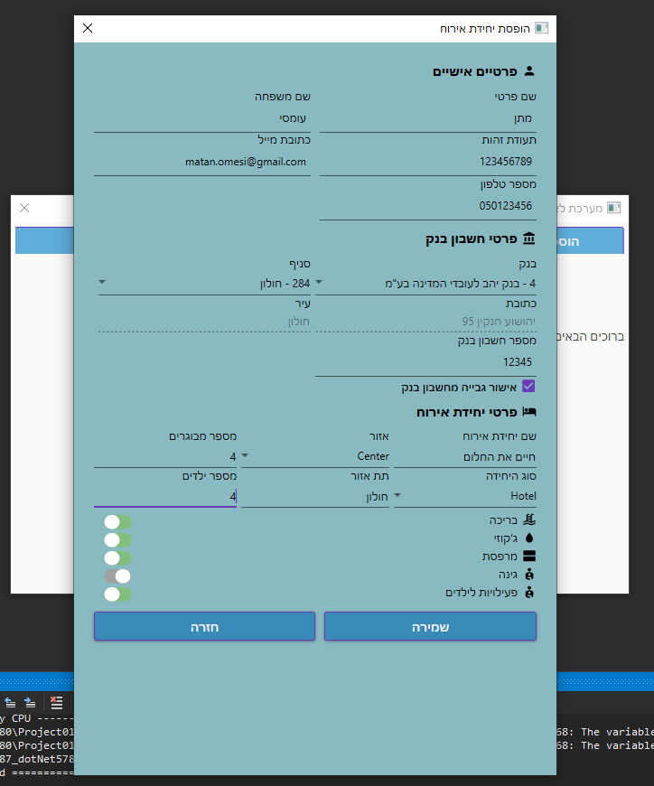
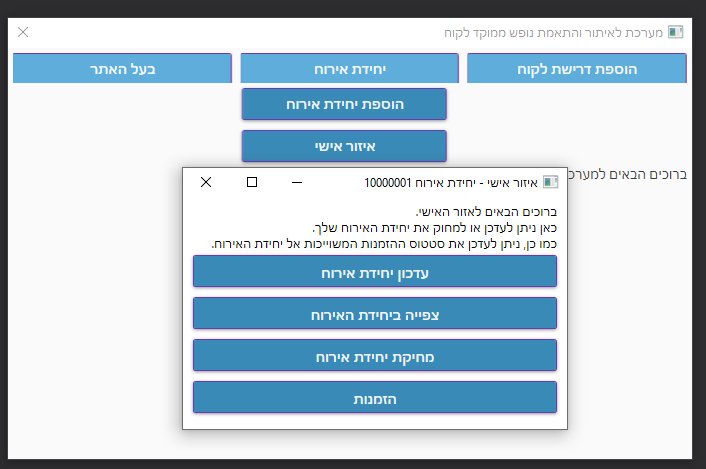
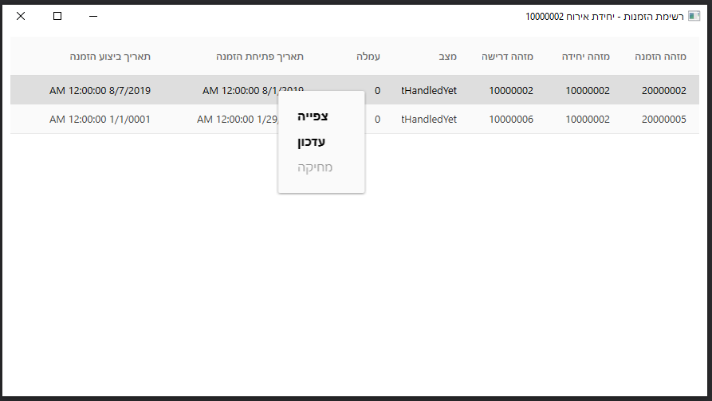
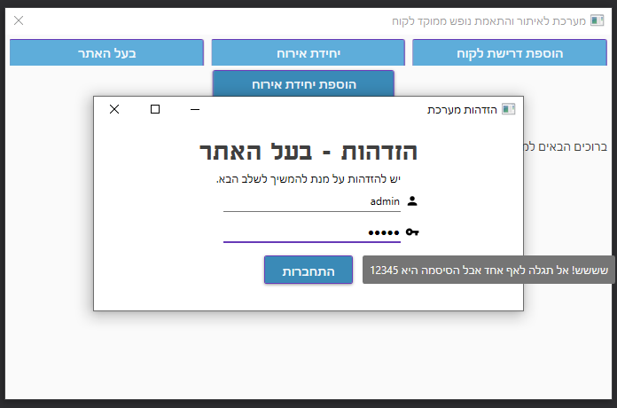
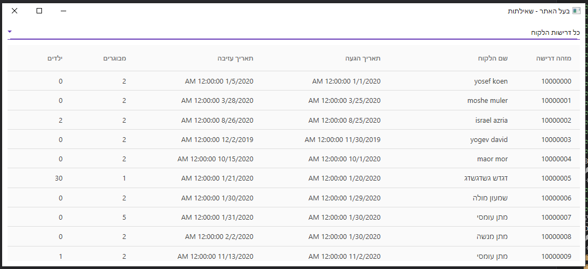
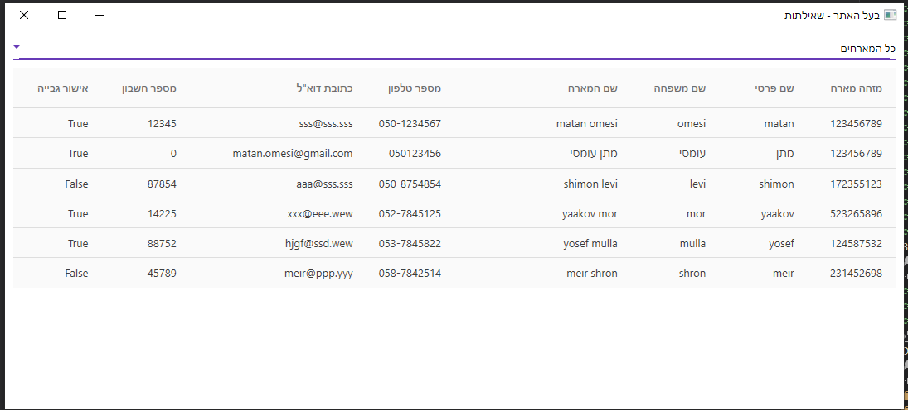

# HostingUnits-Project
A WPF project that connects hosting units with guests and creates orders, USING 3 layers architecture (DAL,BL,BE), Threads, backgroundWorker, XML, Email sender, UI

## Home Page

## Add Guest Request

## Add Guest Request - Complete

## Add Hosting Unit - Choose Bank Details

## Add Hosting Unit - Complete 

## Hosting Unit - Private Area

## Hosting Unit - Orders

## Administrator Login

## List of All Guests Requests

## List of All Hosting Units

